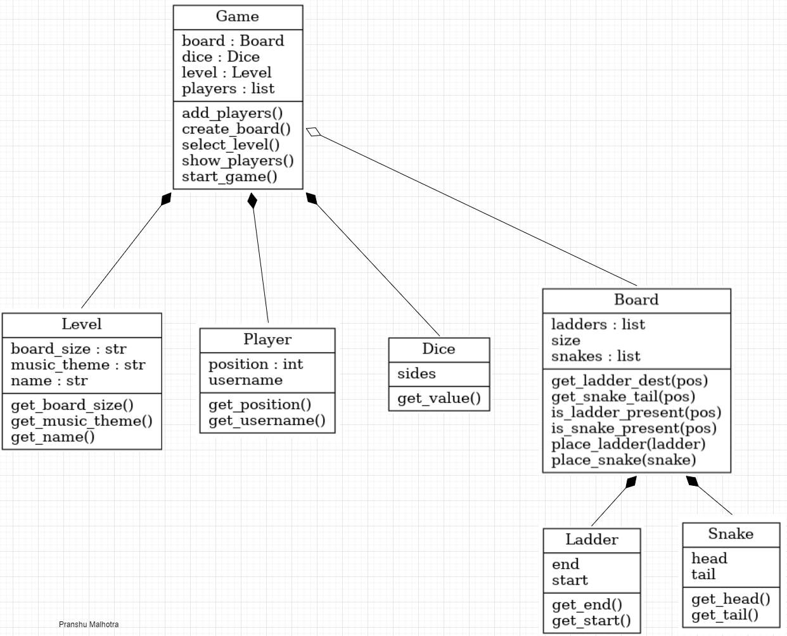

# snake-ladders-LLD



## Assumptions

1. Allow multiple number of players
2. Allow multiple levels
3. Allow configurable board according to a level
4. Allow Snakes and Ladders are configurable (class::board exposes snake/ladder list)
5. Allow configurable Dice
6. Allow configurable Player
7. All I/O via console
8. The focus was on class design so input error handling is not implemented yet

## Run
1. clone repo
2. open terminal in the cloned repo directory and `$ python main.py`

## Sample tests
```
Easy
2
Player1
Player2
<keep pressing enter>
```
```
Medium
5
Player1
Player2
Player3
Player4
Player5
<keep pressing enter>
```

## Sample output
```
/workspace/snake-ladders-LLD (main) $ python main.py
select level: Easy/Medium/Hard: Easy
Add Players for a New Game
Enter Number of Players: 2
Enter name Player#1: Pranshu
Enter name Player#2: Piyush
Players Added: 
2 Players:
Pranshu
Piyush
Starting Game...
====================< 1 >========================
-> Pranshu turn
throw dice -- <press Enter>
    You got 3
    Great!! You found a ladder
    you climb to 22
    your Latest Position is 22
-> Piyush turn
throw dice -- <press Enter>
    You got 4
    your Latest Position is 4
====================< 2 >========================
-> Pranshu turn
throw dice -- <press Enter>
    You got 2
    your Latest Position is 24
-> Piyush turn
throw dice -- <press Enter>
    You got 4
    your Latest Position is 8
====================< 3 >========================
-> Pranshu turn
throw dice -- <press Enter>
    You got 1
    your Latest Position is 25
-> Piyush turn
throw dice -- <press Enter>
    You got 6
    Got 6, throw again -- <press Enter>
    You got 1
    your Latest Position is 15
====================< 4 >========================
-> Pranshu turn
throw dice -- <press Enter>
    You got 2
    Hiss!! snake bites
    you fall down to 1
    your Latest Position is 1
-> Piyush turn
throw dice -- <press Enter>
    You got 1
    your Latest Position is 16
====================< 5 >========================
-> Pranshu turn
throw dice -- <press Enter>
    You got 4
    Great!! You found a ladder
    you climb to 8
    your Latest Position is 8
-> Piyush turn
throw dice -- <press Enter>
    You got 4
    Great!! You found a ladder
    you climb to 29
    your Latest Position is 29
====================< 6 >========================
-> Pranshu turn
throw dice -- <press Enter>
    You got 4
    your Latest Position is 12
-> Piyush turn
throw dice -- <press Enter>
    You got 1
    your Latest Position is 30
    Hurray!! Piyush win.
```
